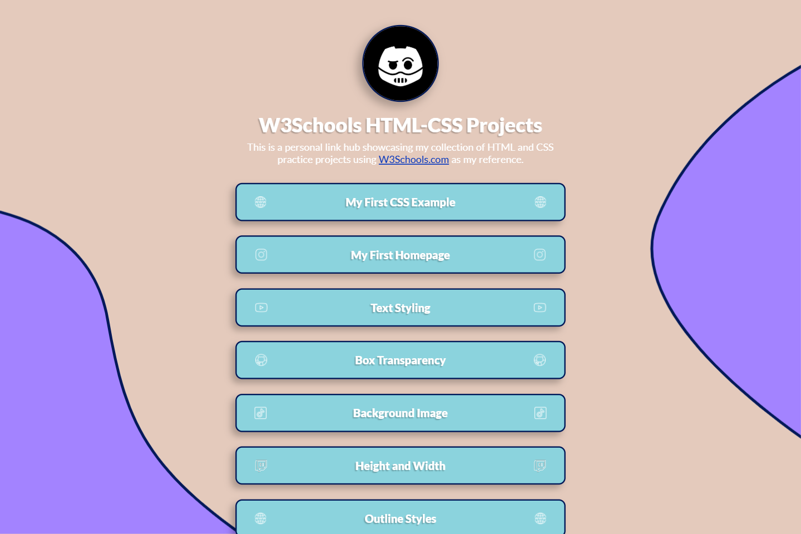

# 💻 W3Schools Projects

## ℹ️ A Collection of HTML-CSS W3Schools Practice Projects

| _Mobile Preview (375x812)_                            | _Desktop Preview (1440x960)_                             |
| ----------------------------------------------------- | -------------------------------------------------------- |
|       |       |
|  |  |

This compilation linktree website was made during my **third month** learning frontend web development.

The individual HTML-CSS projects linked here were created during my **first month** of study, based on [W3Schools.com](https://www.w3schools.com/) tutorials. This website serves as an organized and styled hub to navigate all of them easily, while also showcasing my growth in layout structuring, accessibility, and responsiveness.

---

## 🔍 Overview

This project is a single-page website that acts as a visual hub for my HTML and CSS practice sheets. It includes accessible navigation, visual icons for each project, dark mode support, and fully responsive behavior across screen sizes.

It was designed mobile-first and styled using CSS custom properties, ARIA enhancements, and semantic HTML to provide a learning portfolio that looks polished and professional while still rooted in beginner-level concepts.

---

## ✨ Features

- Mobile-first responsive layout using `clamp()` and `media queries`
- Custom dark mode theme using `prefers-color-scheme`
- Accessible skip link and descriptive ARIA labels
- Semantic HTML5 structure (`<main>`, `<section>`, `<header>`, `<footer>`)
- Visually-enhanced list of 18 HTML/CSS practice projects
- Social icon-based flair next to each link
- Favicon and Open Graph tags for social media previews
- Clean and readable typography via Google Fonts

---

## 📚 Included Projects

- My First CSS Example
- My First Homepage
- Text Styling
- Box Transparency
- Background Image
- Height and Width
- Outline Styles
- Text Formats
- Text Fonts
- Links and Buttons
- Lists
- Tables
- Display
- Width vs Max-Width
- CSS Layouts Showcase 1 & 2
- CSS Advanced Topics
- CSS Additional Topics

Each of these projects was a direct hands-on implementation of topics I studied on [W3Schools.com](https://www.w3schools.com/).

---

## 🧠 What I Learned

- How to build reusable layout sections with semantic structure
- Using `aria-label`, `role`, and `aria-labelledby` for assistive tech
- Setting up a dark mode with CSS variables and media queries
- Applying responsive sizing with `clamp()` and percentages
- Designing accessible and engaging link components
- Organizing multiple practice projects into a single entry point
- Enhancing project discoverability using proper meta tags

---

## 🛠️ Tech Used

- HTML5
- CSS3
- Figma
- Git
- GitHub
- Netlify

---

## 🚀 How to Run

1. Clone the repository
2. Open `index.html` in your browser

---

## 🌐 Live Demo

Or you can check out the 👉 [live website here](https://html-css-projects-w3s-jiro.netlify.app/)

---

## 🧑‍💻 Author

Created by **Elmar Chavez**

🗓️ Month/Year: **June 2025**

📚 Journey: **3rd** month of learning _frontend web development_.
